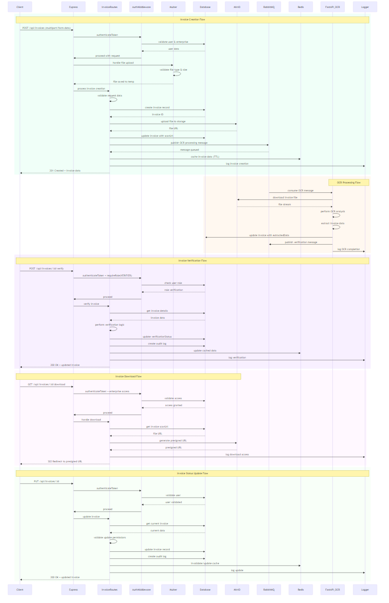
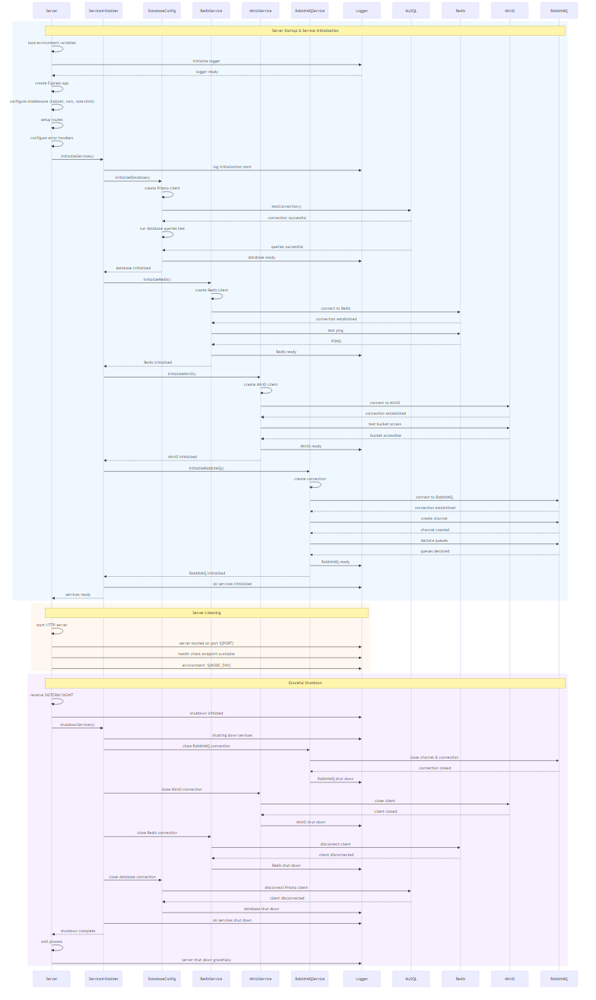
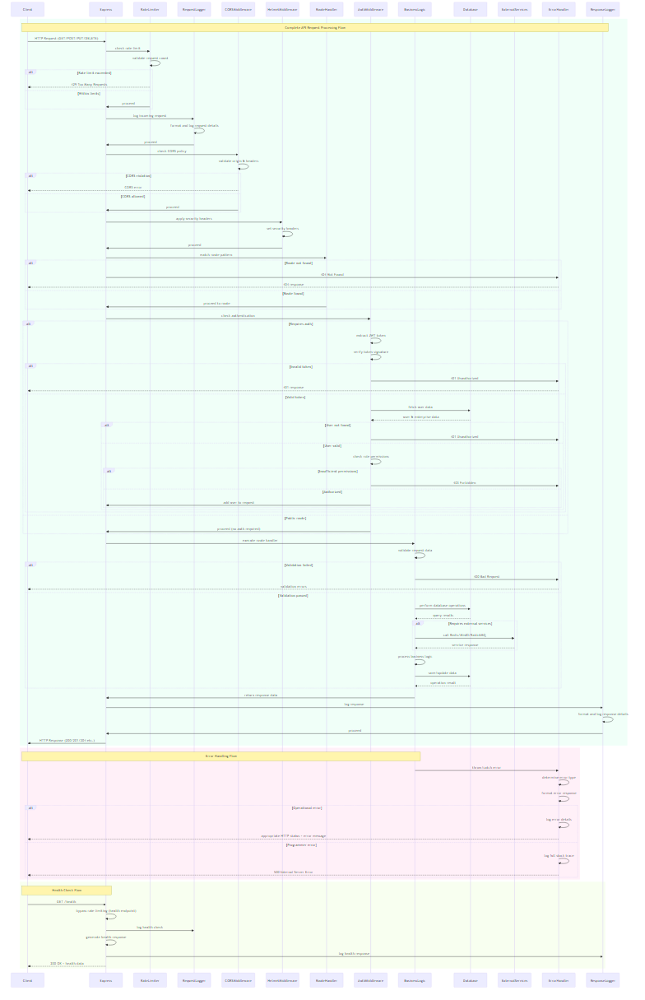

# THEA – Rapport de Sprint (Backend Node.js)

Date: 21 septembre 2025

Ce rapport synthétise les objectifs, les réalisations, les tests et la qualité logicielle du sprint en cours pour le backend THEA (Node.js/Express/Prisma), avec intégration des diagrammes UML, des captures d’écran et des métriques de couverture.

## Sommaire détaillé

- 1. Contexte et objectifs du sprint
- 2. Réalisations clés du sprint
- 3. Architecture & technologies (avec icônes)
- 3.1 Architecture détaillée
- 3.2 Technologies détaillées
- 4. Workflows et diagrammes UML
	- 4.1 Diagramme de classes
	- 4.2 Authentification (séquence)
	- 4.3 Factures (séquence)
	- 4.4 Initialisation des services (séquence)
	- 4.5 Traitement d’une requête API (séquence)
- 5. Tests, santé des services et endpoints
- 6. Couverture de tests et qualité
- 7. Observabilité & DevSecOps
- 8. Prochaines étapes
- 9. Annexe – Galerie d’images

---

## 1. Contexte et objectifs du sprint

L’objectif principal de ce sprint était d’assurer la robustesse opérationnelle du backend THEA et de documenter clairement son architecture et ses flux:

- Démarrage des conteneurs et vérification de santé (Node.js, MySQL, Redis, RabbitMQ, MinIO).
- Tests d’accessibilité des endpoints publics et protégés (authentification et autorisations).
- Génération et organisation de diagrammes UML (classes et séquences) pour les flux critiques.
- Exécution de la suite Jest/JUnit et production des rapports de couverture.
- Consolidation documentaire (ce rapport) avec images, tableaux et sommaire détaillé.

## 2. Réalisations clés du sprint

- Conteneurs démarrés et services externes joignables (Ping/Health OK).
- Endpoints publics accessibles et endpoints privés correctement protégés (401 sans jeton).
- Diagrammes UML générés (Mermaid → PNG) et centralisés dans `documentation/diagrams`.
- Suite de tests: 22/22 suites, 226/226 tests PASS.
- Rapports générés: HTML Coverage, LCOV, Cobertura XML, JUnit XML.

## 3. Architecture & technologies (avec icônes)

- Runtime: Node.js 🟩
- Framework: Express 🚏
- Base de données: MySQL 🐬 via Prisma 🔷
- Cache: Redis 🔴
- File de messages: RabbitMQ 🐇
- Stockage objet: MinIO 🟧 (S3-compatible)
- Sécurité: Helmet 🛡️, CORS 🌐, Rate Limiting ⏱️
- Journalisation: Winston 🧭 (rotation quotidienne)
- CI/Qualité: Jest ✅, JUnit 📄, Couverture HTML/LCOV 📊

Logos des technologies (liens):

| Technologie | Logo (lien) | Site officiel |
|-------------|-------------|---------------|
| Node.js     | https://nodejs.org/static/images/logo.svg | https://nodejs.org |
| Express     | https://vectorlogo.zone/logos/expressjs/expressjs-icon.svg | https://expressjs.com |
| MySQL       | https://vectorlogo.zone/logos/mysql/mysql-icon.svg | https://www.mysql.com |
| Prisma      | https://vectorlogo.zone/logos/prisma/prisma-icon.svg | https://www.prisma.io |
| Redis       | https://vectorlogo.zone/logos/redis/redis-icon.svg | https://redis.io |
| RabbitMQ    | https://vectorlogo.zone/logos/rabbitmq/rabbitmq-icon.svg | https://www.rabbitmq.com |
| MinIO       | https://vectorlogo.zone/logos/minioio/minioio-icon.svg | https://min.io |
| JWT         | https://vectorlogo.zone/logos/json_web_token/json_web_token-icon.svg | https://jwt.io |
| Jest        | https://vectorlogo.zone/logos/jestjsio/jestjsio-icon.svg | https://jestjs.io |
| JUnit       | https://junit.org/junit5/assets/img/junit5-logo.png | https://junit.org |
| Mermaid     | https://vectorlogo.zone/logos/mermaid-js/mermaid-js-icon.svg | https://mermaid.js.org |
| Docker      | https://vectorlogo.zone/logos/docker/docker-icon.svg | https://www.docker.com |
| Prometheus  | https://vectorlogo.zone/logos/prometheusio/prometheusio-icon.svg | https://prometheus.io |
| Grafana     | https://vectorlogo.zone/logos/grafana/grafana-icon.svg | https://grafana.com |

Bibliothèques complémentaires:

- Validation: Express Validator (https://express-validator.github.io/docs/)
- Hachage de mot de passe: bcryptjs (https://www.npmjs.com/package/bcryptjs)

Tableau récapitulatif des services externes:

| Service   | Rôle                               | Statut |
|-----------|------------------------------------|:------:|
| MySQL     | Persistance relationnelle (Prisma) |  ✅    |
| Redis     | Cache / sessions                    |  ✅    |
| RabbitMQ  | File de messages async              |  ✅    |
| MinIO     | Stockage objet                      |  ✅    |

Paragraphe explicatif – démarrage et santé:

La première image présente le lancement des conteneurs applicatifs et de leurs dépendances. Elle atteste que chaque service démarre correctement et passe en état « healthy » ou « running ». La seconde affiche un récapitulatif des vérifications de santé, montrant que l’API et les services externes répondent selon les attentes.

Tableau synthétique – conteneurs et rôles:

| Conteneur/service             | Rôle principal                                   |
|------------------------------|--------------------------------------------------|
| nodejs-backend               | API Express/Prisma                               |
| mysql                        | Base de données relationnelle                    |
| redis                        | Cache en mémoire / PONG                          |
| rabbitmq                     | File de messages (canaux/queues)                 |
| minio                        | Stockage objet compatible S3                      |
| prometheus                   | Collecte de métriques                            |
| grafana                      | Tableaux de bord                                 |
| postgres / vector_store      | Métadonnées/Vector Store (RAG)                    |
| ollama                       | Modèles locaux (LLM)                              |
| fastapi-ocr / worker         | Service OCR asynchrone                            |
| rag-chatbot / worker         | Services conversationnels                         |


### 3.1 Architecture détaillée

- Couche serveur (Express): point d’entrée HTTP, configuration des middlewares transverses (logs, CORS, sécurité, limitation de débit), montage des routes et gestion centralisée des erreurs.
- Couche middlewares: `requestLogger` (traçabilité), `auth` (extraction/validation JWT, contexte utilisateur/entreprise), `errorHandler` (normalisation des erreurs et codes HTTP), `notFoundHandler` (404 cohérentes).
- Couche routes: modules métier indépendants (auth, users, enterprises, clients, suppliers, projects, invoices, stocks, metrics) favorisant la séparation des responsabilités et la testabilité.
- Couche services: intégrations externes encapsulées (Redis, RabbitMQ, MinIO) + initialisation orchestrée garantissant des connexions prêtes avant l’écoute HTTP.
- Couche données: Prisma (schéma typé, migrations, requêtes sécurisées) sur MySQL (intégrité relationnelle, indexation, FK) avec stratégie multi-tenant (scopage par `enterpriseId`).
- Démarrage/Arrêt: séquence d’initialisation (env → logger → app → middlewares → routes → services) et arrêt gracieux (fermeture ordonnée des connexions: RabbitMQ, MinIO, Redis, MySQL).
- Sécurité d’API: JWT (authN), RBAC (authZ), validation d’entrée côté serveur, protections OWASP (Helmet, CORS, Rate Limit), journalisation d’audit.
- Observabilité: logs structurés (niveau, corrélation requêtes), métriques et healthchecks pour supervision (cf. sections 5–7).

### 3.2 Technologies détaillées

- Node.js: moteur d’exécution JS côté serveur, non bloquant (event loop), adapté aux IO intensifs et aux microservices.
- Express: framework HTTP minimaliste, middleware-first, facilitant la composition (chaîne de middlewares) et la clarté des routes.
- Prisma + MySQL: Prisma fournit un client typé, migrations et un modèle de données unifié; MySQL assure ACID, requêtes SQL optimisées et réplication possible.
- Redis: cache en mémoire à latence faible pour accélérer lectures fréquentes, stockage de sessions/tokens temporaires, primitives pub/sub.
- RabbitMQ: file de messages fiable pour traitements asynchrones (ex. OCR), découplage producteur/consommateur, accusés de réception et réessais.
- MinIO: stockage objet compatible S3 pour fichiers (ex. PDFs des factures), URLs présignées pour téléchargements sécurisés.
- Authentification JWT: jetons signés (access/refresh), portabilité côté client, vérification rapide via middleware, contrôle d’expiration/renouvellement.
- Sécurité (Helmet/CORS/Rate Limiting): en-têtes sécurisés, contrôle des origines, limitation de débit pour limiter les abus/DoS.
- Winston (logs): format structuré JSON, niveaux, rotation quotidienne, intégration aisée avec analyseurs/ELK.
- Tests (Jest/JUnit/Couverture): exécution unitaire et d’intégration, rapport JUnit pour CI, couverture HTML/LCOV/Cobertura.
- Mermaid CLI: génération automatisée de diagrammes (classes/séquences) depuis sources `.mmd` vers PNG/SVG.
- Docker Compose: orchestration locale des dépendances (MySQL, Redis, RabbitMQ, MinIO) et du backend pour des environnements reproductibles.

Tableau – Paquets Node.js (rôles & liens):

| Paquet                | Rôle / Usage principal                              | Lien |
|-----------------------|------------------------------------------------------|------|
| express               | Serveur HTTP, routes et middlewares                 | https://expressjs.com |
| prisma                | ORM typé pour MySQL                                 | https://www.prisma.io |
| mysql2                | Pilote MySQL bas niveau                             | https://www.npmjs.com/package/mysql2 |
| jsonwebtoken          | Création/vérification JWT                           | https://www.npmjs.com/package/jsonwebtoken |
| bcryptjs              | Hachage de mots de passe                            | https://www.npmjs.com/package/bcryptjs |
| express-validator     | Validation des entrées HTTP                          | https://express-validator.github.io/docs/ |
| helmet                | En-têtes de sécurité                                | https://helmetjs.github.io |
| cors                  | Politique CORS                                      | https://www.npmjs.com/package/cors |
| express-rate-limit    | Limitation de débit                                 | https://www.npmjs.com/package/express-rate-limit |
| winston               | Journalisation structurée                            | https://github.com/winstonjs/winston |
| multer                | Upload multipart/form-data (fichiers)               | https://github.com/expressjs/multer |
| minio                 | Client MinIO/S3                                     | https://www.npmjs.com/package/minio |
| amqplib               | Client RabbitMQ (AMQP 0-9-1)                        | https://www.npmjs.com/package/amqplib |
| redis                 | Client Redis officiel                                | https://www.npmjs.com/package/redis |
| jest                  | Tests unitaires                                      | https://jestjs.io |
| supertest             | Tests HTTP d’intégration (si utilisé)               | https://www.npmjs.com/package/supertest |

## 4. Workflows et diagrammes UML

Les diagrammes ci-dessous détaillent la structure et les principaux flux applicatifs. Chaque figure est accompagnée d’une explication synthétique pour faciliter la lecture.

### 4.1 Diagramme de classes

Ce diagramme structurel représente l’architecture logique du backend: au centre, l’application Express et sa chaîne de middlewares (journalisation, sécurité, auth, erreurs); autour, les modules de routes par domaine (authentification, utilisateurs, entreprises, clients, fournisseurs, projets, factures, stocks, métriques). À droite, les services externes (Redis, MinIO, RabbitMQ) encapsulés et initialisés au démarrage. En base, les entités Prisma (Enterprise, User, Client, Supplier, Project, Invoice, CompanyStock, Metrics, AuditLog, InvoiceLayout) et leurs relations (par ex. une entreprise possède plusieurs utilisateurs et factures). Ce schéma permet d’identifier les responsabilités et les dépendances.


### 4.2 Authentification (séquence)

Ce diagramme illustre les échanges entre client et serveur pour l’inscription/connexion, le rafraîchissement de jetons et l’accès aux routes protégées. Le serveur valide les entrées, vérifie le mot de passe, émet des jetons JWT (access/refresh) et protège les endpoints via un middleware qui extrait et valide le jeton, charge l’utilisateur et contrôle les permissions (RBAC) et le contexte entreprise (multi-tenant). En cas d’expiration, un jeton d’accès est regénéré à partir du jeton de rafraîchissement.


### 4.3 Factures (séquence)

Ce diagramme couvre le cycle de vie complet d’une facture: dépôt du fichier par le client, validation et enregistrement en base, stockage dans MinIO, publication d’un message dans RabbitMQ pour déclencher l’OCR, traitement asynchrone par le service d’OCR (lecture depuis MinIO, extraction des données, mise à jour de la facture), puis phase de vérification manuelle et génération d’URL présignées pour le téléchargement. Les caches Redis peuvent optimiser les accès répétés.



### 4.4 Initialisation des services (séquence)

Ce diagramme détaille la séquence de démarrage: chargement des variables d’environnement, initialisation du logger, création de l’app Express, montage des middlewares et routes, puis initialisation séquentielle des dépendances (MySQL → Redis → MinIO → RabbitMQ). L’arrêt gracieux suit l’ordre inverse en fermant proprement les connexions pour éviter les fuites de ressources et les messages non traités.



### 4.5 Traitement d’une requête API (séquence)

Ce diagramme montre le parcours d’une requête: contrôle de débit, logs d’entrée, CORS, headers de sécurité, puis vérification du JWT, récupération de l’utilisateur, contrôle des droits, validation des entrées, exécution de la logique métier (CRUD via Prisma, intégrations Redis/MinIO/RabbitMQ), formatage de la réponse et logs de sortie. Les erreurs sont centralisées pour garantir des réponses cohérentes.



Matrice – Statuts HTTP (extraits du flux):

| Cas                                | Middleware/Composant | Statut |
|------------------------------------|----------------------|:------:|
| Dépassement de quota               | RateLimiter          | 429    |
| Route introuvable                  | RouteHandler         | 404    |
| Jeton manquant/incorrect           | AuthMiddleware       | 401    |
| Permissions insuffisantes          | AuthMiddleware       | 403    |
| Validation d’entrée échouée        | BusinessLogic        | 400    |
| Erreur interne (programmer error)  | ErrorHandler         | 500    |

## 5. Tests, santé des services et endpoints

Cette section rassemble les vérifications de disponibilité des services et l’accessibilité des endpoints. Les contrôles confirment que l’API expose un endpoint public de santé et que les endpoints sensibles sont protégés par JWT.

Tableau des comportements d’authentification:

| Type d’endpoint | Requête sans JWT | Requête avec JWT valide |
|------------------|-------------------|-------------------------|
| Public (`/health`)| 200 OK            | 200 OK                  |
| Protégé           | 401 Unauthorized  | 200/201 selon l’action  |

Tableau des middlewares principaux (extraits):

| Middleware            | Rôle principal                                |
|-----------------------|-----------------------------------------------|
| Request Logger        | Journalise chaque requête et sa latence       |
| Rate Limiter          | Prévention d’abus et de déni de service       |
| Helmet (sécurité)     | Ajoute des en-têtes de sécurité               |
| CORS                  | Contrôle des origines et méthodes autorisées  |
| Auth (JWT)            | Vérifie le token et charge l’utilisateur      |
| Error Handler         | Normalise les erreurs et codes HTTP           |

Paragraphe explicatif – tests d’accessibilité et connectivité:

La capture « Health & Connectivity Check Test » montre un script PowerShell qui:

- Interroge `/health` et remonte le statut de l’API (200 OK).
- Vérifie la base MySQL via `mysqld is alive` (docker exec + mysqladmin ping).
- Mesure la santé de Redis via `PONG` (redis-cli ping).
- Valide RabbitMQ avec `rabbitmq-diagnostics ping` → « Ping succeeded ».
- Contrôle MinIO avec un GET sur `/minio/health/live` → 200.

Une fois ces vérifications passées, le script appelle des endpoints d’API et affiche les messages reçus. Les routes encore non implémentées renvoient « Implementation pending », ce qui prouve la chaîne réseau, la configuration des routes et, pour les endpoints protégés, le contrôle d’authentification.


Paragraphe explicatif – endpoints dépendants de la base de données:

La capture « Database-Dependent Endpoints » exécute en boucle des appels GET vers des routes métier (`/users`, `/enterprises`, `/clients`, `/suppliers`, `/projects`, `/stocks`). Pour chacune, le script affiche le nom de la route et le message retourné. Cette vérification confirme que:

- La table de routage Express est correctement branchée.
- La base est joignable via Prisma (sinon les erreurs seraient remontées).
- Les messages « Implementation pending » servent de placeholder contrôlé, utiles avant l’activation de la logique complète.


### 5.1 Scripts de vérification exécutés (PowerShell)

Résumé des scripts et de ce qu’ils valident:

| Script/Bloc | Vérification effectuée | Extraits attendus |
|-------------|------------------------|-------------------|
| Comprehensive Health Check Summary | Santé de l’API et dépendances (HTTP + docker exec) | `Node.js Backend: OK`, `mysqld is alive`, `PONG`, `Ping succeeded`, `MinIO: 200` |
| Testing Service Connectivity from Node.js Backend | Connectivité depuis l’API vers services (ex. Redis via /api/metrics) | `All service connections verified!`, réponse JSON du endpoint |
| Testing Database-Dependent Endpoints | Boucle sur routes métier dépendantes de MySQL | `USERS/ENTERPRISES/...: <message>` |
| FINAL HEALTH CHECK REPORT | Synthèse complète + statut des endpoints | `ALL HEALTH CHECKS PASSED!` |

Exemple – Health Check global:

```text
Comprehensive Health Check Summary:
Node.js Backend: OK
MySQL: mysqld is alive
Redis: PONG
RabbitMQ: Ping succeeded
MinIO: 200
All Health Services are Operational!
```

Exemple – Connectivité depuis l’API:

```text
Testing Service Connectivity from Node.js Backend...
Testing Metrics Endpoint (uses Redis):
All service connections verified!
message
-------
Metrics route - Implementation pending
```

Exemple – Routes dépendantes de la base:

```text
Testing Database-Dependent Endpoints...
USERS: Users route - Implementation pending
ENTERPRISES: Enterprises route - Implementation pending
CLIENTS: Clients route - Implementation pending
SUPPLIERS: Suppliers route - Implementation pending
PROJECTS: Projects route - Implementation pending
STOCKS: Stocks route - Implementation pending
Database connectivity verified through API responses!
```

Exemple – Rapport final:

```text
FINAL HEALTH CHECK REPORT
SERVICE HEALTH STATUS:
Node.js Backend (Port 3000): OK
MySQL (Port 3307): mysqld is alive
Redis (Port 6379): PONG
RabbitMQ (Port 5672/15672): Ping succeeded
MinIO (Port 9000/9001): 200

API ENDPOINT HEALTH:
/metrics : Metrics route - Implementation pending
/users : Users route - Implementation pending
/enterprises : Enterprises route - Implementation pending
...
ALL HEALTH CHECKS PASSED!
```

Tableau – Endpoints testés et messages:

| Endpoint      | Message attendu                        | Nature |
|---------------|----------------------------------------|--------|
| /api/metrics  | Metrics route - Implementation pending  | Protégé / Redis |
| /api/users    | Users route - Implementation pending    | Protégé / MySQL |
| /api/enterprises | Enterprises route - Implementation pending | Protégé / MySQL |
| /api/clients  | Clients route - Implementation pending  | Protégé / MySQL |
| /api/suppliers| Suppliers route - Implementation pending| Protégé / MySQL |
| /api/projects | Projects route - Implementation pending | Protégé / MySQL |
| /api/stocks   | Stocks route - Implementation pending   | Protégé / MySQL |

## 6. Couverture de tests et qualité

Résultats de la suite Jest/JUnit du sprint:

- Suites: 22 / 22 PASS – Tests: 226 / 226 PASS.
- Couverture (global):

| Métrique    | Pourcentage |
|-------------|------------:|
| Statements  | 50.88%      |
| Branches    | 54.92%      |
| Functions   | 40.21%      |
| Lines       | 50.96%      |

Paragraphe explicatif – interprétation de la couverture:

La couverture indique la proportion de code exécutée par les tests. Les branches mesurent les chemins conditionnels, tandis que les fonctions reflètent la part de logique exercée. Les valeurs actuelles confirment une base de tests solide sur les parcours principaux, avec une marge d’amélioration sur les fonctions et scénarios alternatifs.

Tableau de synthèse (couverture globale):

| Métrique   | Valeur |
|------------|-------:|
| Statements | 50.88% |
| Branches   | 54.92% |
| Functions  | 40.21% |
| Lines      | 50.96% |

Captures des rapports de couverture:

la vue console de Jest récapitule 22 suites/226 tests PASS. Le tableau indique par fichier les pourcentages et les plages de lignes non couvertes (ex.: services avec peu de couverture). Cette granularité permet de prioriser rapidement où ajouter des tests (erreurs, timeouts, chemins négatifs, intégrations externes). Un setup/teardown dédié prépare/épure la base de test.


Couverture par module (statements):

| Module      | Statements |
|-------------|-----------:|
| config      | 59.37%     |
| middleware  | 84.16%     |
| routes      | 86.00%     |
| services    | 7.35%      |

Ouverture du rapport HTML local:

- Emplacement: `nodejs_backend/coverage/index.html`
- Variante détaillée par fichier: `nodejs_backend/coverage/lcov-report/index.html`

## 7. Observabilité & DevSecOps

- Logs structurés via Winston (rotation quotidienne) et journaux applicatifs conservés dans `nodejs_backend/logs`.
- Métriques/monitoring prévus: intégration Prometheus/Grafana (architecture cible), journaux et traces corrélés.
- Sécurité par conception: headers sécurité (Helmet), CORS, rate limiting, validation d’entrées, RBAC/JWT.
- Outils sécurité envisagés/diagrammés: Snyk, Trivy, OWASP ZAP, Nessus.

## 8. Prochaines étapes

- Augmenter la couverture des tests unitaires (fonctions/services) et d’intégration (routes protégées complexes).
- Ajouter des tests d’erreur et de résilience (timeouts, indispo Redis/RabbitMQ/MinIO, erreurs SQL).
- Étendre l’observabilité: métriques personnalisées, tableaux de bord, alerting.
- Industrialiser les scans SAST/DAST et images (CI).
- Documentation continue: guides d’API (OpenAPI), glossaire métier, schémas de données.

Conclusion et sprint suivant (FastAPI OCR):

- Le backend est stable (tous services OK, endpoints protégés, 226 tests PASS) et son architecture est documentée par des diagrammes explicatifs.
- La priorité de couverture est la couche « services » afin de fiabiliser les intégrations externes.
- Sprint suivant: focaliser l’OCR FastAPI (qualité d’extraction, gestion des files RabbitMQ, reprise sur erreur, idempotence) et ajouter des tests d’intégration bout-en-bout (upload → OCR → vérification).

---

Notes d’utilisation:

- Les images sont stockées dans `documentation/` et les diagrammes dans `documentation/diagrams/`.
- Pour regénérer un diagramme Mermaid en PNG: `mmdc -i chemin/source.mmd -o sortie.png --scale 2`
- Pour consulter la couverture: ouvrir `nodejs_backend/coverage/index.html` dans le navigateur.

Résumé d’exigences → sections:

- Icônes/technos: section 3.
- Tests et images: sections 5 et 6.
- Diagrammes UML: section 4.
- Tableaux récapitulatifs: sections 3 et 6.
- Sommaire détaillé: en tête de document.

## 9. Annexe – Galerie d’images

Cette annexe regroupe toutes les captures présentes dans `documentation/` pour une consultation rapide.

1) Démarrage des services via Docker Compose

liste visuelle des 14 conteneurs « Running/Healthy » qui composent la plateforme; utile pour diagnostiquer rapidement une dépendance non démarrée.


1) Rapport final de healthcheck

« FINAL HEALTH CHECK REPORT » liste d’abord la santé des services (Node.js OK, MySQL alive, Redis PONG, RabbitMQ ping succeeded, MinIO 200), puis parcourt des endpoints (`/metrics`, `/users`, etc.) et reporte les messages associés. Le bloc se conclut par « ALL HEALTH CHECKS PASSED! » attestant de la disponibilité globale.


1) Tests d’accessibilité et de connectivité (services + endpoints)

« Testing Service Connectivity from Node.js Backend » vérifie depuis l’API la capacité à joindre les services dépendants (ex. endpoint `metrics` qui s’appuie sur Redis). Le message « All service connections verified! » confirme la communication effective.


1) Endpoints dépendants de la base de données

inventaire utile des routes qui échoueraient si la base est indisponible, pour prioriser des tests de dégradation et des messages d’erreur explicites.


1) Couverture Jest (extrait)

sortie CLI Jest avec récapitulatif par fichier et delta de lignes non couvertes – base opérationnelle pour une roadmap d’amélioration ciblée (priorité: services; compléter les branches et erreurs). 


1) Couverture globale (synthèse)

vue HTML « All files » d’Istanbul/nyc; la comparaison par module (config, middleware, routes, services) met en évidence le besoin d’ajouter des tests sur la couche services.


