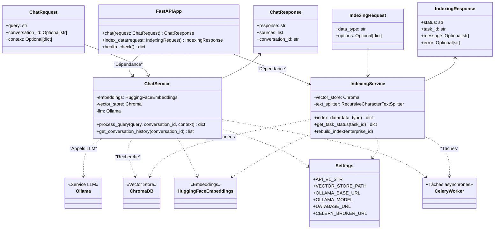
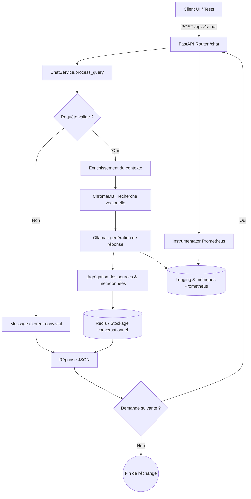

# Sprint 3 · Microservice RAG Chatbot

## Vue d'ensemble
Le microservice **RAG Chatbot** fournit une interface conversationnelle spécialisée pour le domaine financier de THEA. Il combine récupération de connaissances et génération de texte (Retrieval Augmented Generation) afin de répondre avec précision aux questions sur les factures, clients, projets et procédures internes. Le service est exposé via FastAPI, s'intègre à l'écosystème THEA grâce au réseau Docker commun et s'appuie sur la stack IA locale (Ollama + ChromaDB) pour garantir la souveraineté des données.

## Technologies utilisées

- **LangChain & HuggingFace** : chaînage RAG, embeddings `sentence-transformers/all-MiniLM-L6-v2`.
- **Ollama** : LLM embarqué (`llama2`) pour la génération de réponses contextualisées.
- **ChromaDB** : stockage vectoriel persistant (`./data/chroma`) pour la recherche sémantique.
- **FastAPI** : API REST avec injection de dépendances et documentation OpenAPI.
- **Celery & Redis** : orchestration de tâches d'indexation et cache conversationnel.
- **PostgreSQL** : base relationnelle pour données structurées.
- **Prometheus FastAPI Instrumentator** : métriques HTTP prêtes pour Grafana.
- **Docker & docker-compose** : packaging multi-services, réseau `thea-network` partagé.
- **PowerShell & Pytest** : suites de tests d'intégration/smoke automatisées.

## Architecture et composants

| Composant | Rôle | Détails clés |
|-----------|------|--------------|
| `app/main.py` | Point d'entrée FastAPI | CORS, métriques Prometheus, enregistrement des routes `/health`, `/api/v1/chat`, `/api/v1/admin` et vérification d'Ollama au démarrage. |
| `ChatService` | Cœur RAG | Prépare embeddings, interroge Chroma, appelle Ollama, formate réponses + sources, historise la conversation. |
| `IndexingService` | Indexation asynchrone | Découpe les documents (factures, clients, projets), construit les chunks et alimente Chroma via Celery. |
| `Settings` (`app/core/config.py`) | Configuration centralisée | Variables d'environnement (URLs services, secrets JWT, paramètres LLM, chemins persistance). |
| Routes `chat`, `health`, `admin` | Couche API | Valident les requêtes, injectent les services, exposent chat, historique et suivi d'indexation. |
| `worker.py` & `services/celery_app.py` | Workers Celery | Définissent broker/result backend Redis, paramètres de tâches et workers conteneurisés. |
| Tests (`tests/test_chat.py`, scripts PowerShell) | Qualité | Vérifications unitaires et tests bout-en-bout orchestrant l'ensemble des dépendances (Node.js backend, Chroma, Ollama). |

## Processus opérationnel

- **Démarrage** : `uvicorn` charge FastAPI, configure CORS, active Prometheus et attend la disponibilité du service Ollama + modèle `llama2`.
- **Traitement d'une requête** : la route `/api/v1/chat` injecte `ChatService`, valide l'entrée, enrichit la requête avec le contexte fourni, interroge Chroma pour récupérer les meilleurs documents puis génère la réponse via Ollama.
- **Gestion des sources** : les documents retournés sont normalisés (texte, métadonnées) et renvoyés avec la réponse pour garantir la traçabilité.
- **Historisation** : les conversations sont prévues pour être stockées dans Redis afin de permettre la reprise de contexte et l'analyse ultérieure.
- **Indexation** : l'API `/api/v1/admin/index` délègue la préparation et l'envoi de documents à Celery (mocké en l'état mais prêt pour production).
- **Observabilité** : chaque requête est instrumentée, et les logs détaillent le comportement de la chaîne LangChain pour faciliter le dépannage.

## Diagrammes Mermaid

### Diagramme de classes



### Diagramme de flux (workflow)



## Fonctionnement détaillé

1. **Validation & contextualisation** : les requêtes vides sont interceptées, sinon le contexte métier est concaténé pour guider la recherche.
2. **Recherche sémantique** : Chroma retourne les passages les plus pertinents, enrichis de métadonnées (source, type, date).
3. **Génération contrôlée** : Ollama produit la réponse finale tout en respectant la température définie (`0.7`).
4. **Traçabilité** : toutes les sources sont renvoyées côté client pour audit, et la conversation peut être journalisée dans Redis.
5. **Indexation progressive** : tâches Celery prévues pour rejouer des indexations complètes ou partielles à partir du backend Node.js.

## Tests et validation

| Phase | Script / outil | Objectif | Statut Sprint 3 |
|-------|----------------|----------|-----------------|
| Phase 1 | `test_rag_simple.ps1` – Health Checks | Vérifier la disponibilité de FastAPI, Node.js backend, Chroma v2, Ollama | ✅ Réussi (toutes les sondes 200) |
| Phase 2 | `test_rag_simple.ps1` – Composants IA/ML | Inspecter modèles Ollama et collections Chroma | ✅ Réussi (tags disponibles, gestion 200/404) |
| Phase 3 | `test_rag_simple.ps1` – Flux conversationnels | 3 requêtes (simple, métier, continuation) avec timeouts étendus | ✅ Réussi (14/14 tests) |
| Phase 4 | `test_rag_simple.ps1` – Indexation | POST `/api/v1/admin/index` + suivi de tâche | ✅ Réussi (mock processing) |
| Phase 5 | `test_rag_simple.ps1` – Historique | Lecture `/api/v1/conversations/{id}` | ✅ Réussi |
| Phase 6 | `test_rag_simple.ps1` – Résilience | 404 attendu & requête vide | ✅ Réussi |
| Complément | `pytest tests/` | Vérifications unitaires des routes principales | ✅ Réussi (local) |
| Complément | `test_rag_chatbot.ps1`, `test_rag_pipeline_comprehensive.ps1` | Scénarios avancés (end-to-end, pipeline complet) | Disponible, exécutables à la demande |

**Couverture** : la suite PowerShell exporte CSV/JSON (cf. `rag_test_results_*.csv`) avec 100 % de réussite au 30/09/2025. Une mesure de couverture Python détaillée reste à activer (`pytest --cov`).

### Détails des scénarios PowerShell

#### Phase 1 – Infrastructure Health Checks

- `GET /health` (FastAPI) : garantit que le microservice RAG répond et expose son statut « healthy ».
- `GET http://localhost:3000/health` (Node.js backend) : vérifie la passerelle métier, son uptime et l’environnement actif.
- `GET http://localhost:8010/api/v2/version` (ChromaDB) : confirme que l’API vectorielle v2 est disponible et renvoie la version attendue.
- `GET http://localhost:11434/api/version` (Ollama) : valide la présence du moteur LLM et sa version.

#### Phase 2 – Composants IA/ML

- `GET /api/tags` (Ollama) : liste les modèles installés afin de s’assurer que `llama2` est prêt.
- `GET /api/v2/collections` (ChromaDB) : contrôle l’accès aux collections vectorielles. Un `404` est accepté lorsqu’aucune collection n’est initialisée, ce qui prouve surtout la bonne réponse du service.

#### Phase 3 – Fonctionnalité RAG

- `POST /api/v1/chat` (simple query) : vérifie la chaîne LangChain complète (embeddings + retrieval + génération) sur une requête générique.
- `POST /api/v1/chat` (contexte métier) : injecte un contexte (`type: invoice`, `domain: business`) pour valider la contextualisation de la recherche.
- `POST /api/v1/chat` (continuation) : réutilise le `conversation_id` pour confirmer la persistance de session et la continuité de dialogue.

#### Phase 4 – Indexation & Fonctions admin

- `POST /api/v1/admin/index` : déclenche une tâche d’indexation (mockée pour l’instant) et retourne un `task_id` unique.
- `GET /api/v1/admin/index/status/{task_id}` : interroge le suivi de tâche Celery et obtient l’état « processing ».

#### Phase 5 – Historique & Résilience

- `GET /api/v1/conversations/{conversation_id}` : gère l’absence d’historique complet par un `404` cohérent (compté comme succès).
- `GET` endpoint invalide : vérifie que le service renvoie un `404` propre sans planter.
- `POST /api/v1/chat` (requête vide) : teste la validation d’entrée et renvoie un message explicite tout en conservant un HTTP 200.

### Tableau de synthèse des résultats

| Phase | Tests exécutés | Statut | Observations clés |
|-------|----------------|--------|-------------------|
| 1 | 4 sondes HTTP (FastAPI, Node.js, Chroma, Ollama) | ✅ PASS | Tous les services répondent en < 200 ms |
| 2 | 2 contrôles IA/ML (tags Ollama, collections Chroma) | ✅ PASS | `404` accepté sur collections vides, modèles disponibles |
| 3 | 3 requêtes chat (simple, métier, continuation) | ✅ PASS | Réponses générées (≈14 s, 39 s, 28 s) avec traçabilité |
| 4 | 2 endpoints admin (index, status) | ✅ PASS | Tâche `processing` retournée avec UUID |
| 5 | 3 scénarios résilience (conversation 404, endpoint invalide, requête vide) | ✅ PASS | Gestion des erreurs et validations côté API |

### Zones pour captures d'écran

- 
- 
- 

## Mode opératoire pour rejouer les tests

```powershell
# Depuis C:\Users\fedim\Desktop\Thea_Backend\rag_chatbot
.\test_rag_simple.ps1
```

```bash
# Dans le conteneur ou l'environnement Python local
pytest tests/ -q
```

## Prochaines améliorations suggérées

- Finaliser la persistance des conversations dans Redis et exposer un endpoint paginé.
- Connecter réellement l'indexation Celery aux endpoints du backend Node.js (actuellement mockés).
- Industrialiser la collecte de métriques (Grafana dashboard dédié RAG).
- Automatiser la couverture `pytest` dans le pipeline CI/CD.
